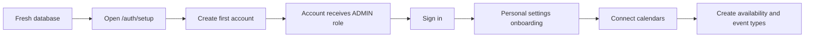
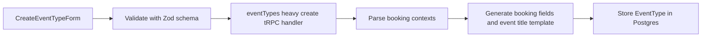
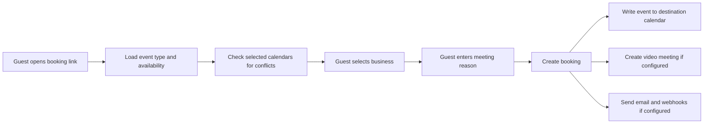
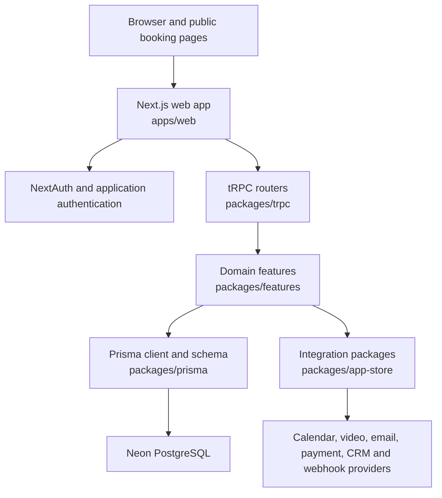

# Schiceya Cal

<p align="center">
  <a href="https://schiceya-cal.vercel.app">
    
  </a>
</p>

<p align="center">
  <strong>One scheduling workspace for every part of your work.</strong>
</p>

<p align="center">
  <a href="https://schiceya-cal.vercel.app">Live application</a>
  |
  <a href="https://github.com/cyberjessai-lab/schiceya-cal">GitHub repository</a>
  |
  <a href="./CONTRIBUTING.md">Contributing</a>
  |
  <a href="./LICENSE">MIT license</a>
</p>

Schiceya Cal is a private, self-hosted scheduling workspace for a person who runs multiple businesses but wants bookings to arrive through one system and one calendar workflow. It is built on [Cal.diy](https://github.com/calcom/cal.diy), the MIT-licensed community edition derived from Cal.com.

The central Schiceya feature asks each booker what business or area their meeting belongs to and what they want to discuss. That context is then included in the calendar event title, so a single calendar remains easy to understand.

> [!IMPORTANT]
> The current Schiceya deployment is designed for trusted, single-admin, personal use. It is not approved for public multi-user or multi-tenant use. Several inherited permission-checking paths contain permissive placeholder implementations. Keep public signup disabled and read [Security and current limitations](#security-and-current-limitations) before exposing the service to other account holders.

## Table of contents

- [Purpose](#purpose)
- [Current deployment](#current-deployment)
- [Features](#features)
- [Schiceya-specific behavior](#schiceya-specific-behavior)
- [User journeys](#user-journeys)
- [Architecture](#architecture)
- [Repository structure](#repository-structure)
- [Data model](#data-model)
- [Technology stack](#technology-stack)
- [Local development](#local-development)
- [Environment variables](#environment-variables)
- [Database operations](#database-operations)
- [Testing and quality checks](#testing-and-quality-checks)
- [Vercel deployment](#vercel-deployment)
- [Scheduled jobs](#scheduled-jobs)
- [Integrations](#integrations)
- [Security and current limitations](#security-and-current-limitations)
- [Before a public launch](#before-a-public-launch)
- [Troubleshooting](#troubleshooting)
- [Maintenance guide](#maintenance-guide)
- [Project history and licensing](#project-history-and-licensing)

## Purpose

Running several businesses often creates fragmented scheduling:

- different booking pages;
- separate calendar administration;
- unclear event titles;
- repeated availability configuration;
- difficulty seeing which business generated a meeting.

Schiceya Cal addresses that by providing one booking administration workspace. The owner can create event types, connect calendars, define availability, and decide which calendar receives new bookings. When an event type is created, the owner can also provide business categories such as:

```text
PatientCare, Consulting, Personal
```

The public booking form then requires the guest to select a category and describe the meeting. A resulting calendar title can look like:

```text
[Consulting] Jesse - Website strategy
```

Schiceya Cal is a scheduling hub, not a replacement calendar provider. Google Calendar, Microsoft 365, Apple Calendar, CalDAV, or another supported provider still stores the resulting events. Connected calendars can be used for conflict checking, while one chosen destination calendar receives bookings.

## Current deployment

The production snapshot documented here was verified on June 12, 2026.

| Area | Current configuration |
| --- | --- |
| Application | [https://schiceya-cal.vercel.app](https://schiceya-cal.vercel.app) |
| Hosting | Vercel |
| Database | Neon Serverless Postgres |
| Runtime region | Vercel `sfo1` |
| Database region | Neon `us-west-2` |
| Account model | Private, single administrator |
| Public signup | Disabled |
| Onboarding plan selector | Removed |
| Database migrations | 595 migration directories applied at the time of this audit |
| Cron frequency | Daily, compatible with the current Vercel Hobby configuration |
| Email delivery | Must be configured before relying on email notifications or password reset |

No credentials, database URLs, tokens, or secret values belong in this README.

## Features

### Schiceya features

- Private first-user setup that creates the initial user as a system administrator.
- No personal-versus-team plan selection during onboarding.
- Direct onboarding into personal profile and scheduling settings.
- Schiceya Cal name, logo, wordmark, email branding, and interface labels.
- Business/context options when creating an event type.
- Required booking-purpose selection for event types configured with those options.
- Required meeting-reason text for the same event types.
- Context-rich calendar titles using the selected business and reason.
- Signup-disabled production mode for a private personal installation.
- Vercel and Neon deployment configuration.
- Vercel Hobby-compatible daily maintenance schedules.

### Core scheduling capabilities inherited from Cal.diy

The codebase also contains the broader scheduling platform inherited from Cal.diy:

- public booking pages and shareable event links;
- configurable event types and durations;
- availability schedules, date overrides, time zones, and travel schedules;
- selected calendars for conflict detection;
- destination calendar selection;
- booking creation, confirmation, rescheduling, cancellation, and no-show handling;
- recurring events, seats, hosts, and attendee records;
- out-of-office periods and holiday settings;
- calendar, video, CRM, payment, analytics, automation, and webhook packages;
- embeds and platform packages;
- API keys, OAuth clients, webhooks, and a separate API v2 service;
- team and organization data models and user-interface modules;
- audit, reporting, filter, watchlist, and internal-note models.

Presence in the repository does not mean a feature is configured, supported by the current deployment, or safe for public use. Integration credentials and external services must be configured individually. Team and organization functionality also requires a full authorization audit before use by untrusted users.

## Schiceya-specific behavior

### Booking context configuration

The event creation form contains a field labeled **Business and booking options**. The administrator enters comma-separated choices.

The implementation:

1. Splits the text on commas.
2. Trims whitespace.
3. Removes empty entries.
4. Removes duplicates without regard to letter case.
5. Preserves the spelling of the first occurrence.
6. Creates two required booking fields when at least one option remains.

The generated fields are:

| Internal name | Type | Booker label | Required |
| --- | --- | --- | --- |
| `business` | Select | `What are you booking for?` | Yes |
| `title` | Text | `What would you like to discuss?` | Yes |

The generated event-name template is:

```text
[{business}] {Scheduler} - {title}
```

If the administrator leaves the options field blank, the event type keeps the normal upstream booking-field and title behavior.

> [!NOTE]
> This automation currently runs when a new event type is created. Editing an existing event type does not automatically regenerate these fields. Existing event types can be adjusted manually, or the implementation can later be extended to the update handler.

Relevant files:

- [`packages/features/eventtypes/components/CreateEventTypeForm.tsx`](./packages/features/eventtypes/components/CreateEventTypeForm.tsx)
- [`packages/features/eventtypes/lib/bookingContext.ts`](./packages/features/eventtypes/lib/bookingContext.ts)
- [`packages/features/eventtypes/lib/bookingContext.test.ts`](./packages/features/eventtypes/lib/bookingContext.test.ts)
- [`packages/features/eventtypes/lib/schemas.ts`](./packages/features/eventtypes/lib/schemas.ts)
- [`packages/trpc/server/routers/viewer/eventTypes/heavy/create.handler.ts`](./packages/trpc/server/routers/viewer/eventTypes/heavy/create.handler.ts)

### Private onboarding

On a completely empty database:

1. `/auth/setup` displays the first-user setup.
2. The setup API checks that the database contains zero users.
3. It validates the username, name, email, and password.
4. It creates a verified Cal-identity user with the system role `ADMIN`.
5. Further setup requests are rejected after a user exists.
6. After sign-in, incomplete onboarding goes directly to `/onboarding/personal/settings`.
7. The removed plan-selection screen cannot be used to downgrade the owner to a limited personal plan.

The production environment also sets `NEXT_PUBLIC_DISABLE_SIGNUP=true`. Normal account registration is therefore rejected unless an inherited invite flow explicitly permits it.

Relevant files:

- [`apps/web/app/api/auth/setup/route.ts`](./apps/web/app/api/auth/setup/route.ts)
- [`apps/web/app/api/auth/signup/route.ts`](./apps/web/app/api/auth/signup/route.ts)
- [`apps/web/app/(use-page-wrapper)/onboarding/getting-started/page.tsx`](<./apps/web/app/(use-page-wrapper)/onboarding/getting-started/page.tsx>)
- [`packages/features/auth/lib/onboardingUtils.ts`](./packages/features/auth/lib/onboardingUtils.ts)
- [`packages/features/onboarding/lib/onboarding-path.service.ts`](./packages/features/onboarding/lib/onboarding-path.service.ts)

### Branding

Branding is controlled by environment variables and local assets:

- `NEXT_PUBLIC_APP_NAME=Schiceya Cal`
- `NEXT_PUBLIC_COMPANY_NAME=Schiceya`
- `EMAIL_FROM_NAME=Schiceya Cal`
- `NEXT_PUBLIC_SENDER_ID`
- [`apps/web/public/schiceya-cal-icon.svg`](./apps/web/public/schiceya-cal-icon.svg)
- [`apps/web/public/schiceya-cal-wordmark.svg`](./apps/web/public/schiceya-cal-wordmark.svg)
- [`packages/lib/constants.ts`](./packages/lib/constants.ts)
- [`packages/ui/components/logo/Logo.tsx`](./packages/ui/components/logo/Logo.tsx)

## User journeys

### Initial owner setup



### Create a context-aware event type



### Public booking



## Architecture

### Runtime overview



### Responsibility boundaries

| Layer | Responsibility |
| --- | --- |
| `apps/web/app` | Next.js App Router pages, layouts, route handlers, metadata, and server entry points |
| `apps/web/modules` | Web-specific views and user-interface flows |
| `packages/trpc/server` | Authenticated and public application procedures, routers, and request orchestration |
| `packages/features` | Domain logic for bookings, calendars, availability, event types, onboarding, users, and more |
| `packages/prisma` | Prisma schema, generated client, migrations, seeds, and database utilities |
| `packages/app-store` | Provider integrations and app metadata |
| `packages/ui` and `packages/coss-ui` | Shared interface components and design primitives |
| `packages/lib` | Shared constants, authentication helpers, logging, utilities, and server configuration |
| `packages/emails` | Transactional email templates and sending logic |
| `packages/embeds` | Booking embed libraries and snippets |
| `packages/platform` | Platform SDK, types, constants, and reusable API components |

### Request path

A typical authenticated mutation follows this path:

```text
React form
  -> tRPC client
  -> authenticated tRPC procedure
  -> router handler
  -> feature/repository service
  -> Prisma
  -> Neon Postgres
  -> response and UI cache update
```

A booking may additionally call calendar, conferencing, email, payment, CRM, analytics, and webhook providers, depending on the event type and installed credentials.

## Repository structure

This is a Yarn workspaces and Turborepo monorepo.

```text
.
|-- apps/
|   |-- web/                 Main Next.js application deployed to Vercel
|   |-- api/                 Small development proxy for API workflows
|   |-- api/v2/              Separate NestJS platform API service
|   `-- docs/                Nextra documentation application
|-- packages/
|   |-- app-store/           Provider integrations
|   |-- app-store-cli/       App-store development tooling
|   |-- config/              Shared configuration
|   |-- coss-ui/             Additional UI package
|   |-- dayjs/               Shared date/time setup
|   |-- debugging/           Debugging helpers
|   |-- emails/              Email templates and mail logic
|   |-- embeds/              Embed packages
|   |-- features/            Domain modules
|   |-- i18n/                Localization utilities
|   |-- kysely/              Typed SQL support
|   |-- lib/                 Shared application utilities
|   |-- platform/            Platform SDK and API packages
|   |-- prisma/              Schema, migrations, generated client, seeds
|   |-- sms/                 SMS-related logic
|   |-- testing/             Shared test utilities
|   |-- trpc/                Application API routers and procedures
|   |-- tsconfig/            Shared TypeScript configuration
|   |-- types/               Shared TypeScript declarations
|   `-- ui/                  Shared React components
|-- scripts/                 Repository-level operational scripts
|-- .env.example             Environment variable reference
|-- package.json             Workspace scripts and dependency policy
|-- turbo.json               Task graph and environment inputs
|-- yarn.lock                Locked dependency graph
`-- apps/web/vercel.json     Production build, region, and cron settings
```

Important feature directories include:

- `auth`, `onboarding`, `users`, and `profile`;
- `eventtypes`, `availability`, `schedules`, `slots`, and `selectedSlots`;
- `bookings`, `booking-audit`, `bookingReport`, and `noShow`;
- `calendars`, `selectedCalendar`, `calendar-subscription`, and `busyTimes`;
- `conferencing`, `credentials`, `webhooks`, and `notifications`;
- `ooo`, `holidays`, `timezone`, and `travelSchedule`;
- `form`, `form-builder`, `filters`, `data-table`, and `tasker`;
- `oauth`, `platform-oauth-client`, and `api-keys-legacy`.

At the time of this audit, the web App Router contains 79 `page.tsx` files and 39 `route.ts` files. These counts are descriptive, not contractual, and will change as the project evolves.

## Data model

The canonical schema is [`packages/prisma/schema.prisma`](./packages/prisma/schema.prisma). Migrations live in [`packages/prisma/migrations`](./packages/prisma/migrations).

Major model groups include:

| Domain | Representative models |
| --- | --- |
| Identity and authentication | `User`, `UserPassword`, `Account`, `Session`, `VerificationToken`, `ResetPasswordRequest` |
| Authorization | `Role`, `RolePermission`, `Membership`, `ApiKey`, `OAuthClient` |
| Scheduling | `EventType`, `Schedule`, `Availability`, `SelectedSlots`, `TravelSchedule` |
| Bookings | `Booking`, `Attendee`, `BookingReference`, `BookingSeat`, `Payment`, `Tracking` |
| Calendars | `Credential`, `SelectedCalendar`, `DestinationCalendar`, `CalendarCache`, `CalendarCacheEvent` |
| Teams and organizations | `Team`, `Profile`, `OrganizationSettings`, `ManagedOrganization`, `TeamFeatures` |
| Time away | `OutOfOfficeEntry`, `OutOfOfficeReason`, `UserHolidaySettings`, `HolidayCache` |
| Integrations and automation | `App`, `Webhook`, `WebhookScheduledTriggers`, `Task`, `PlatformOAuthClient` |
| Reporting and audit | `BookingAudit`, `BookingReport`, `WrongAssignmentReport`, `WatchlistAudit` |
| Product configuration | `Feature`, `UserFeatures`, `Deployment`, `FilterSegment`, `InternalNotePreset` |

All schema changes must be represented by a Prisma migration. Do not edit production tables manually unless performing a documented recovery operation.

## Technology stack

The main web application uses:

- Node.js, with Node 20.9 or newer required by Next.js 16;
- Yarn 4.12.0, pinned in the repository;
- Turborepo 2.7;
- Next.js 16;
- React 18;
- TypeScript 5.9;
- tRPC;
- Prisma 6;
- PostgreSQL, hosted on Neon in production;
- NextAuth 4;
- Zod and React Hook Form;
- TanStack Query;
- Tailwind CSS 4;
- Vitest and Testing Library;
- Playwright;
- Biome.

For local development, Node 20.17 LTS or a version matching the Vercel runtime is recommended. The production deployment currently uses a Node 24 runtime.

## Local development

### Prerequisites

- Git
- Node.js 20.17 or newer
- Corepack
- Docker Desktop for the easiest local PostgreSQL setup, or access to a PostgreSQL 13+ database
- Optional: MailHog or another SMTP service for email testing

On Windows, WSL or Git Bash gives the best compatibility because some inherited scripts use Unix-style environment assignment and commands.

### Install

```bash
git clone https://github.com/cyberjessai-lab/schiceya-cal.git
cd schiceya-cal
corepack enable
yarn install --immutable
```

The repository pins Yarn through `.yarnrc.yml`, so using `npm install` or generating a different lockfile is not supported.

### Configure the environment

```bash
cp .env.example .env
```

At minimum, set the database URLs, application URLs, authentication secret, encryption key, and cron secrets described in [Environment variables](#environment-variables).

For local development:

```env
NEXT_PUBLIC_WEBAPP_URL=http://localhost:3000
NEXT_PUBLIC_WEBSITE_URL=http://localhost:3000
NEXT_PUBLIC_EMBED_LIB_URL=http://localhost:3000/embed/embed.js
NEXTAUTH_URL=http://localhost:3000
NEXT_PUBLIC_APP_NAME="Schiceya Cal"
NEXT_PUBLIC_COMPANY_NAME="Schiceya"
NEXT_PUBLIC_DISABLE_SIGNUP=true
```

Use real generated secrets in `.env`; never reuse the examples shown in `.env.example` for production.

### Start local infrastructure

The simplest option is to point `DATABASE_URL` and `DATABASE_DIRECT_URL` to a dedicated Neon development branch.

For a local database matching the default port and database name in `.env.example`, start standalone development containers:

```bash
docker run --name schiceya-postgres \
  -e POSTGRES_HOST_AUTH_METHOD=trust \
  -e POSTGRES_DB=calendso \
  -p 5450:5432 \
  -d postgres:18

docker run --name schiceya-redis \
  -p 6379:6379 \
  -d redis:7
```

The root [`docker-compose.yml`](./docker-compose.yml) is intended for running the full containerized application stack, not only the database for a host-based `yarn dev` process.

### Prepare the database

```bash
yarn workspace @calcom/prisma db-deploy
yarn db-seed
```

For a clean private installation, seeding may create sample or test data that you do not want. If the goal is to exercise the real first-user `/auth/setup` flow, deploy migrations to an empty database and do not run the general seed.

### Start the web application

```bash
yarn dev
```

Open [http://localhost:3000](http://localhost:3000).

If the database has no users, open [http://localhost:3000/auth/setup](http://localhost:3000/auth/setup) and create the first administrator.

### Common commands

| Command | Purpose |
| --- | --- |
| `yarn dev` | Run the main web app in development mode |
| `yarn build` | Build the web app and its workspace dependencies |
| `yarn start` | Start a previously built web app |
| `yarn type-check` | Run TypeScript checks across the task graph |
| `yarn lint` | Run Biome lint tasks |
| `yarn format` | Format the repository with Biome |
| `yarn test` | Run the Vitest suite in UTC |
| `yarn e2e` | Run Playwright web tests |
| `yarn test-e2e` | Seed the database, then run Playwright |
| `yarn db-deploy` | Deploy pending Prisma migrations |
| `yarn db-seed` | Seed the database |
| `yarn db-studio` | Open Prisma Studio |
| `yarn prisma <args>` | Run Prisma CLI commands in the Prisma workspace |
| `yarn dev:api` | Run the web app and API proxy task graph |

## Environment variables

The full reference is [`.env.example`](./.env.example). The groups below explain the values that matter most to Schiceya Cal.

### Required application variables

| Variable | Purpose |
| --- | --- |
| `DATABASE_URL` | Pooled PostgreSQL connection used by the application |
| `DATABASE_DIRECT_URL` | Direct PostgreSQL connection used by Prisma migrations |
| `NEXT_PUBLIC_WEBAPP_URL` | Public origin of the web application |
| `NEXT_PUBLIC_WEBSITE_URL` | Public website origin, usually the same as the web app |
| `NEXT_PUBLIC_EMBED_LIB_URL` | Public URL of the generated embed script |
| `NEXTAUTH_URL` | NextAuth base URL; production currently uses the deployed auth URL |
| `NEXTAUTH_SECRET` | Signs and encrypts authentication data |
| `CALENDSO_ENCRYPTION_KEY` | Encrypts stored integration credentials |
| `CRON_API_KEY` | Legacy/query-header authorization for supported cron handlers |
| `CRON_SECRET` | Bearer token used by Vercel Cron and task endpoints |

### Branding and private-mode variables

| Variable | Recommended value | Purpose |
| --- | --- | --- |
| `NEXT_PUBLIC_APP_NAME` | `Schiceya Cal` | Product name in the interface |
| `NEXT_PUBLIC_COMPANY_NAME` | `Schiceya` | Company/owner brand |
| `NEXT_PUBLIC_SENDER_ID` | Your sender identifier | Sender branding where supported |
| `EMAIL_FROM_NAME` | `Schiceya Cal` | Display name on email |
| `NEXT_PUBLIC_DISABLE_SIGNUP` | `true` | Blocks normal public registration |
| `CALCOM_TELEMETRY_DISABLED` | `1` | Disables upstream telemetry |
| `CRON_ENABLE_APP_SYNC` | `false` | Prevents unnecessary app-sync cron work for this deployment |

Variables beginning with `NEXT_PUBLIC_` are exposed to browser bundles and are often captured at build time. Never put secrets in them.

### Email

Email is optional for basic local interface testing, but production booking notifications, verification, and password recovery require a working provider.

Use either:

- `RESEND_API_KEY`, or
- `EMAIL_SERVER_HOST`, `EMAIL_SERVER_PORT`, `EMAIL_SERVER_USER`, and `EMAIL_SERVER_PASSWORD`.

Also configure `EMAIL_FROM` and `EMAIL_FROM_NAME`.

Without a valid email transport:

- booking emails may not be delivered;
- password-reset messages may not be delivered;
- verification and reminder workflows may fail or log warnings.

### Generate secrets

Examples using OpenSSL:

```bash
openssl rand -base64 32
openssl rand -base64 24
openssl rand -hex 32
```

Use separately generated values for authentication, credential encryption, and cron authorization. Store them in `.env` locally and in Vercel environment variables for production. Do not commit them.

### Optional integrations

Calendar, conferencing, payment, CRM, analytics, messaging, and OAuth integrations each require provider-specific variables. Consult `.env.example` and the corresponding package under `packages/app-store`.

## Database operations

### Connection strategy

For Neon:

- `DATABASE_URL` should normally use the pooled connection string for runtime traffic.
- `DATABASE_DIRECT_URL` should use the direct connection string for migrations.
- Keep the database region close to the Vercel function region.
- Use separate Neon branches or databases for production, preview, development, and destructive testing.

### Apply migrations

```bash
yarn workspace @calcom/prisma db-deploy
```

The Prisma package build also runs [`packages/prisma/auto-migrations.ts`](./packages/prisma/auto-migrations.ts). It attempts `prisma migrate deploy` when both database URLs are available, unless:

```env
SKIP_DB_MIGRATIONS=1
```

For controlled production releases, explicitly applying and reviewing migrations is still preferable to relying only on build-time behavior.

### Create a migration

Against a development database:

```bash
yarn workspace @calcom/prisma prisma migrate dev --name describe_the_change
```

Review the generated SQL before committing it.

### Inspect data

```bash
yarn db-studio
```

Prisma Studio is a development and administration tool. Do not expose it publicly.

### Backup and recovery

Before high-risk schema or data changes:

1. Confirm Neon point-in-time recovery or branch history is available for the production project.
2. Create a protected branch or snapshot.
3. Test the migration against a copy of production data where permitted.
4. Record the rollback or forward-fix plan.
5. Verify bookings, users, credentials, event types, and selected calendars after deployment.

## Testing and quality checks

### Schiceya booking-context test

```bash
yarn vitest run packages/features/eventtypes/lib/bookingContext.test.ts
```

The focused test verifies:

- required business and reason fields;
- the event-name template;
- whitespace trimming;
- case-insensitive duplicate removal;
- unchanged behavior when no options are provided.

### Recommended change verification

For a focused Schiceya change:

```bash
yarn vitest run packages/features/eventtypes/lib/bookingContext.test.ts
yarn workspace @calcom/web type-check
yarn workspace @calcom/web lint
```

For a broader change:

```bash
yarn type-check
yarn lint
yarn test
yarn build
```

Run relevant Playwright flows when changing authentication, onboarding, event creation, public booking, rescheduling, cancellation, calendar connections, or payments.

### Manual smoke test

1. Sign in as the administrator.
2. Create an event type with three business options.
3. Open its public booking link in a private browser window.
4. Confirm the business selector and meeting-reason field are required.
5. Complete a booking.
6. Confirm the event is stored in Schiceya Cal.
7. Confirm the destination calendar receives the event.
8. Confirm the title includes the selected business and reason.
9. Confirm connected conflict-check calendars block busy slots.
10. Reschedule and cancel the booking to verify provider synchronization.

## Vercel deployment

The main production app is `apps/web`. Its Vercel settings are defined in [`apps/web/vercel.json`](./apps/web/vercel.json).

### Project settings

Use:

| Setting | Value |
| --- | --- |
| Root directory | `apps/web` |
| Install command | Defined by `apps/web/vercel.json` |
| Build command | Defined by `apps/web/vercel.json` |
| Framework | Next.js |
| Region | `sfo1` |

The custom install command runs from the monorepo root:

```bash
cd ../.. && yarn install --immutable --mode=skip-build
```

The custom build command is:

```bash
cd ../.. && NODE_OPTIONS=--max-old-space-size=8192 yarn build
```

`--mode=skip-build` prevents workspace post-install scripts from racing before the full build task graph is ready. The build then runs the required generated-package and Prisma tasks in Turborepo order.

The UI icon build uses `--no-errors-on-unmatched` so ignored or absent generated icon files do not fail a clean Vercel build.

### Deploy with Git

The normal production flow is:

1. Commit a reviewed change.
2. Push it to the GitHub branch connected to Vercel.
3. Let Vercel create a preview or production deployment.
4. Review build logs.
5. Smoke-test authentication, event creation, booking, and calendar delivery.

### Deploy with the CLI

```bash
corepack enable
yarn install --immutable
npx vercel link
npx vercel pull --yes --environment=production
npx vercel deploy --prod
```

Do not download production secrets into a location that can be committed.

### Production environment checklist

- URLs point to the production domain and use HTTPS.
- `NEXT_PUBLIC_DISABLE_SIGNUP=true`.
- Neon pooled and direct URLs point to the correct production database.
- Auth, encryption, and cron secrets are unique and strong.
- Email transport is configured if email-dependent flows are expected.
- OAuth callback URLs exactly match the production routes.
- Preview deployments do not silently connect to the production database.
- `sfo1` remains appropriate for the selected Neon region.

## Scheduled jobs

All schedules in Vercel are UTC. The current deployment uses daily schedules to remain compatible with Vercel Hobby limits.

| UTC time | Endpoint | Purpose |
| --- | --- | --- |
| 00:00 | `/api/cron/calendar-subscriptions` | Maintain calendar subscription state |
| 01:00 | `/api/tasks/cron` | Process scheduled task work |
| 02:00 | `/api/tasks/cleanup` | Clean completed or expired task data |
| 03:00 | `/api/cron/calendar-subscriptions-cleanup` | Remove stale calendar subscription data |
| 04:00 | `/api/cron/queuedFormResponseCleanup` | Clean queued form responses |
| 05:00 | `/api/cron/credentials` | Maintain or validate credential-related state |
| 06:00 | `/api/cron/selected-calendars` | Maintain selected-calendar state |

Vercel sends `Authorization: Bearer <CRON_SECRET>` when `CRON_SECRET` is configured. The handlers also contain compatibility logic for `CRON_API_KEY` where applicable.

If the project moves to a plan or scheduler that supports higher-frequency execution, restore frequencies only after checking each endpoint's cost, idempotency, concurrency behavior, and provider rate limits.

## Integrations

Integration packages are located under [`packages/app-store`](./packages/app-store). Categories include:

| Category | Examples present in the repository |
| --- | --- |
| Calendars | Google Calendar, Microsoft 365, Apple Calendar, CalDAV, Exchange, ICS feeds, Zoho Calendar |
| Video | Google Meet, Microsoft Teams, Zoom, Daily, Jitsi, Webex, Whereby, FaceTime |
| Payments | Stripe, PayPal, HitPay, BTCPay Server |
| CRM | HubSpot, Salesforce, Pipedrive, Close, Attio, Zoho CRM |
| Automation | Zapier, Make, n8n, Pipedream |
| Analytics | Google Analytics, Google Tag Manager, Plausible, PostHog, Matomo, Umami |
| Messaging | Discord, Telegram, WhatsApp, Signal-related packages |

To enable an integration:

1. Read its package metadata and implementation.
2. Create the provider application or credentials.
3. Configure callback and webhook URLs.
4. Add only the required environment variables.
5. Install or enable it from the Schiceya interface.
6. Test token refresh, booking creation, rescheduling, cancellation, and disconnection.

Do not assume an integration is production-ready merely because its package exists. Some packages may depend on services, licenses, upstream infrastructure, or feature flags not enabled in this fork.

## Security and current limitations

### Private-use boundary

This repository currently contains multiple local `PermissionCheckService` placeholders whose permission checks return `true`, return empty team lists, or otherwise bypass the complete upstream permission service. There is also an API v2 PBAC guard that documents always-allow behavior.

Affected areas include portions of:

- event type access and creation;
- booking access;
- webhooks;
- out-of-office logic;
- watchlists;
- user and team profile queries;
- PBAC procedures;
- API v2 authorization.

This does not make an unauthenticated visitor an administrator by itself, but it invalidates assumptions required for safe multi-user and multi-tenant authorization. The current safe operating assumption is:

```text
one trusted administrator + public booking pages + public signup disabled
```

Do not create accounts for untrusted users or enable organization/team tenancy until every placeholder is replaced with an actual authorization implementation and tested for horizontal and vertical privilege escalation.

### Secrets

- Never commit `.env`, Vercel exports, database dumps, OAuth credentials, or provider tokens.
- Treat `NEXTAUTH_SECRET`, `CALENDSO_ENCRYPTION_KEY`, database URLs, cron secrets, and OAuth client secrets as production credentials.
- Rotate a secret immediately if it appears in Git history, logs, screenshots, or chat.
- Use different values for local, preview, and production environments.
- Restrict Neon and Vercel account access with multi-factor authentication.

### Personal and booking data

Bookings may contain names, email addresses, phone numbers, meeting topics, calendar metadata, payment details, and webhook payloads. Before collecting real customer data:

- define retention and deletion practices;
- configure privacy and terms pages;
- restrict administrator access;
- verify backups and recovery;
- avoid logging sensitive payloads;
- review provider data-processing agreements;
- understand applicable privacy, healthcare, or industry requirements.

Schiceya Cal is not automatically compliant with HIPAA, GDPR, POPIA, PCI DSS, or another regulatory framework merely because related code or integration names are present.

### Email and account recovery

With public signup disabled and only one administrator, a failed password-reset email can lock the owner out. Configure and test email delivery, retain secure infrastructure access, and document an emergency database-assisted recovery procedure before relying on the service.

### Dependency and upstream risk

This is a large fork with many dependencies and inherited modules. Regularly:

- review Dependabot or equivalent alerts;
- run package audits with appropriate judgment;
- update the fork from Cal.diy carefully;
- inspect upstream changes before merging;
- test migrations and authentication after dependency updates.

## Before a public launch

The following work is required before offering Schiceya Cal to the public:

- Replace every permissive permission-service placeholder with a real implementation.
- Audit all tRPC, route-handler, API v2, webhook, team, and organization authorization paths.
- Add negative tests proving users cannot access another user's bookings, event types, credentials, teams, webhooks, or reports.
- Decide whether the product is single-user, multi-user, team-based, or multi-tenant.
- Re-enable signup intentionally and test invite, verification, password reset, account deletion, and abuse cases.
- Configure reliable transactional email with domain authentication.
- Add rate limiting, bot protection, and Vercel Firewall/WAF rules where appropriate.
- Review OAuth scopes, consent screens, callback URLs, token encryption, and credential deletion.
- Publish accurate privacy, terms, cookie, support, and security-reporting information.
- Add monitoring, error tracking, availability checks, log retention rules, and alerting.
- Verify database backups, point-in-time recovery, restore drills, and tenant-aware deletion.
- Review payment code and billing UI before enabling paid plans.
- Review team and organization UI so inherited options do not promise unsupported behavior.
- Move cron work to appropriate production frequencies and monitor failures.
- Perform a dedicated security review and penetration test.
- Load-test booking, availability, calendar sync, and webhook workflows.
- Establish an incident-response and secret-rotation process.

## Troubleshooting

### `/auth/setup` says no setup is needed

The endpoint only works when the `User` table is empty. Use the normal login page if an owner already exists. Do not delete the production owner just to reopen setup.

### The plan-selection page still appears

Confirm the deployment contains the Schiceya onboarding changes and is not serving an older Vercel build. `/onboarding/getting-started` should redirect to `/onboarding/personal/settings`.

### Signup is still visible or available

Set:

```env
NEXT_PUBLIC_DISABLE_SIGNUP=true
```

Because this is a `NEXT_PUBLIC_` variable, redeploy after changing it.

### Business options do not appear on a booking page

Check that:

- the event type was newly created after the feature was added;
- **Business and booking options** was not blank;
- the event creation request completed successfully;
- the stored event type has generated `bookingFields`;
- you are viewing the correct public event type.

Existing event types are not automatically migrated.

### Calendar title does not contain the business

The event type must have:

```text
[{business}] {Scheduler} - {title}
```

as its event-name template, and the booking must contain both generated fields.

### Build fails during icon generation

Confirm [`packages/ui/scripts/build-icons.mjs`](./packages/ui/scripts/build-icons.mjs) includes SVGO's `--no-errors-on-unmatched` behavior and that generated files have not been inconsistently committed.

### Vercel build runs out of memory

Keep the configured build command with:

```text
NODE_OPTIONS=--max-old-space-size=8192
```

Also check for duplicated dependency installs, accidental build artifacts, and changes that expand the Turborepo task graph.

### Database migration fails

1. Confirm `DATABASE_DIRECT_URL` is a direct, reachable PostgreSQL connection.
2. Check Neon compute status and allowed connections.
3. Run `yarn workspace @calcom/prisma db-deploy` locally against a safe branch.
4. Inspect the failing migration SQL.
5. Do not mark a migration as applied unless the actual schema matches it.

### Booking email is missing

Confirm `EMAIL_FROM` and either SMTP or Resend credentials are configured. Review application logs for mail-transport warnings. A successful database booking does not guarantee email delivery.

### Cron endpoint returns unauthorized

Confirm Vercel has `CRON_SECRET`, redeploy after changing it, and verify the request sends:

```text
Authorization: Bearer <CRON_SECRET>
```

Some endpoints also accept `CRON_API_KEY`; use the handler implementation as the source of truth.

### Calendar slots or conflicts are wrong

Check:

- the user's time zone;
- schedule time zone and overrides;
- selected conflict-check calendars;
- destination calendar;
- provider credential validity;
- calendar sync/subscription cron health;
- daylight-saving transitions;
- provider API errors in logs.

## Maintenance guide

### For every code change

1. Read the owning feature and its tests before editing.
2. Keep Schiceya-specific changes scoped and easy to distinguish from inherited code.
3. Add or update focused tests.
4. Run type checking and linting for affected workspaces.
5. Run a production build for framework, dependency, or deployment changes.
6. Review the Git diff for secrets and unrelated generated files.
7. Deploy to preview when possible.
8. Smoke-test the complete user journey, not only the changed component.

### For every dependency update

1. Read release notes for Next.js, React, Prisma, NextAuth, and provider SDKs.
2. Keep Yarn and the lockfile synchronized.
3. Regenerate Prisma artifacts if required.
4. Run unit, type, build, and relevant end-to-end tests.
5. Verify Vercel runtime compatibility.
6. Check authentication, calendar OAuth, booking, and email delivery.

### For every database change

1. Create a Prisma migration.
2. Review generated SQL.
3. Test against a non-production Neon branch.
4. Confirm forward and recovery behavior.
5. Back up or branch production.
6. Apply the migration.
7. Verify key records and application flows.

### When syncing from Cal.diy

1. Fetch upstream without overwriting Schiceya work.
2. Review upstream migrations and security changes first.
3. Identify conflicts in branding, onboarding, event creation, Vercel configuration, and permission code.
4. Preserve the booking-context behavior and private onboarding.
5. Re-run focused and full verification.
6. Update this README when architecture or operations change.

## Project history and licensing

Schiceya Cal is a personal fork built from [Cal.diy](https://github.com/calcom/cal.diy), which is derived from Cal.com community code. The repository retains the upstream MIT license and copyright notice in [`LICENSE`](./LICENSE).

This fork:

- is independently operated;
- is not an official Cal.com hosted product;
- is not endorsed or supported by Cal.com;
- includes Schiceya-specific branding and product behavior;
- remains subject to the licenses of its dependencies and external services.

Cal.com trademarks and third-party provider trademarks belong to their respective owners.

## Contributing

Read [`CONTRIBUTING.md`](./CONTRIBUTING.md) before opening a pull request. For Schiceya-specific work, a change description should state:

- the user problem;
- the affected flow;
- whether the change is inherited or Schiceya-specific;
- database and environment-variable impact;
- security implications;
- tests and manual verification performed.

Security issues should not be posted publicly with exploitable details. Establish a Schiceya-specific private reporting contact before inviting external users or contributors.

---

Schiceya Cal exists to make a complicated working life easier to read: one scheduling workspace, clear booking context, and fewer calendars to administrate.
